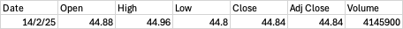
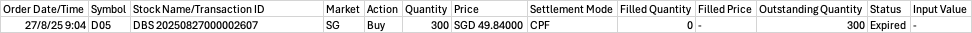

# Getting Started

## Environment variable

The application needs some environment variables in order to run. There are some of the defined
variable having default value, there are some of them are related to the integration with database.
Please update according to your need.

### Optional with default value

```shell
TEMP_FOLDER=temp-folder
SERVER_NAME=cdp-app
LITERAL_NULL=na, nil, -, nan
STRICT_BEAN_PARSER=true
```

### Mandatory value

```shell
DB_URL= <<your_db_connection>> #jdbc:postgresql://localhost:5432/cdpapp?currentSchema=cdp
DB_USERNAME=<<your_db_username>>
DB_PASSWORD=<<your_db_password>>
```

Quickly refer to the http://<your uri>/swagger-ui/index.html (
e.g. http://localhost:9013/swagger-ui/index.html) for the APIs documentation.

# Wiki

- APIs include some of the CRUD request. However, currently it only supports some of the models.
- APIs also include Spring Batch Job Launcher triggering point.

## Models

- Securities
- Transaction
- PriceDaily
- And, more to be defined.

### APIs

The CRUD APIs like:

- _{server_url}_/transactions/*
- _{server_url}_/securities/*

## Spring Batch (Job)

## Models (pre-defined in Spring Batch)

- JobInstance
- JobExecution

### APIs

The CRUD APIs like:

- _{server_url}_/jobs/*
- _{server_url}_/executions/*

The APIs extract some of the fields or objects from the Spring Batch models. These APIs can be use
to verified the job executed from job-launcher.

### Asynchronous Job Launcher

The APIs like:

- _{server_url}_/batch/daily-price/*
- _{server_url}_/batch/transactions

The APIs take in csv files as request-param.
> 1. Import PriceDaily
>
> 
>
> 2. Import Transactions
>
> 

The APIs triggering asynchronous job, stat. The responses from APIs return the job-name, use the
job-name to check the status of job.

### Design

Key features

* The current implementation is designed with Asynchronous Job Launcher. Upon the job submitted, it
  will be executed with background thread.
* Fault-tolerant has been setup for the process. Some (a percentage of error) is allowed, hence,
  only major error exceed the tolerant will lead to failure for the entire process.
* Error logging is designed so that we can re-visit any of the records with error(s).